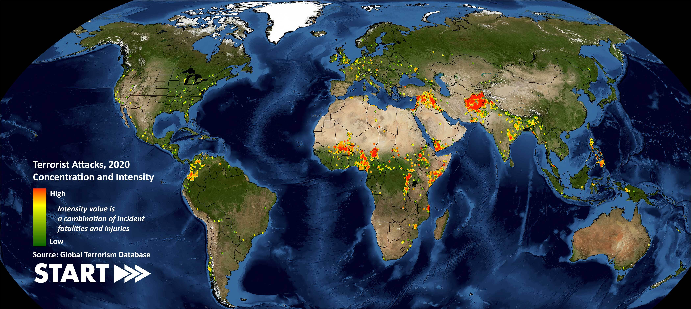

# Data Minning Project,

This is a **Data Minning** project based in a Global Terrorism Database:

The database is a Kaggle data training dataset and is developed in **R** language:

https://www.kaggle.com/datasets/START-UMD/gtd?select=globalterrorismdb_0718dist.csv

Data minnning phases of the project:

- **Data analysis**
- **Data preprocessing**
- **Machine Learning Models**
---

  

  

The terrorists exploit the weak points of countries - both developing and developed - to finance, organize, equip, and train new members, carry out their attacks, and hide to avoid being apprehended. Thus, building capacity in all states must be the cornerstone of the global fight against terrorism. Studying terrorism data is of paramount importance for several reasons:

- **National security**: Terrorism poses a significant threat to national security in many countries. Studying terrorism data allows governments and security agencies to better understand the threats and take measures to prevent and effectively respond to them.

- **Prevention of attacks**: Analyzing terrorism data can help identify patterns and trends that could indicate the planning of a terrorist attack. This information can be used to prevent attacks and save lives.

- **Policy decision-making**: Terrorism data can inform policymakers about the formulation of policies and strategies to address terrorism. Understanding the underlying causes and motivations behind terrorism is essential for developing effective responses.

- **Protection of human rights**: Studying terrorism data can also be useful in ensuring that government responses to terrorism respect human rights and civil liberties. This is essential for balancing national security with the protection of individual freedoms.

- **Public awareness**: The dissemination of terrorism data can increase public awareness of the terrorism threat and the need to take measures to prevent it. This can foster collaboration between society and authorities in the fight against terrorism.

- **International cooperation**: Since terrorism is a transnational threat, data exchange and international cooperation are essential. Studying data

## Data analysis (comprehensive process)

Based in GTD variables guide:

https://www.start.umd.edu/gtd/downloads/Codebook.pdf

This phase explore the dataset and extract their metadata with [analysis exploratory] script. get the next information about each variable:

- Attribute type (nominal, ordinal, numeric, etc.).

- Allowed values (if applicable).
- Percentage of missing values.
- Minimum, maximum, mean, standard deviation (if applicable).
- If numeric, indicate the type of distribution it seems to follow (e.g., normal).
- If categorical, the levels and frequency of each.
- Indicate if the attribute presents outliers.

## Data preprocessing (comprehensive process)
This phase creates the final dataset for minning tasks after cleaning and attribute selection and transformation with [data preprocessing] script:

- Missing values replacement.
    - Central tendency measures
    - Machine learning prediction
- Removal of outliers
- Discretization of numeric attributes
- Normalization

Getting [procesed dataset] as result, ready for models generation

## Minning Tasks

### Clasification Models
This phase generates models that relates the attributes in dataset and evaluates them with [clasification] script.

Models used:

- CART trees
- Neural networks

The results are shown in [report] and final [report presentation]

### Installation
All script are self dependent, and can be executed in a RStudio environment with the installation of their libraries packages.

[analysis exploratory]: /analysisExploratory/analysisDatosTerrorism.R

[data preprocessing]: /dataPreprocessing/dataPreprocessingTerrorism.R

[procesed dataset]: /dataPreprocessing/dataPrepTerrorism.csv

[clustering]: /clustering/clusteringTerrorism.csv

[clasification]: /clasificationModels/clasificationTerrorism.R

[report]: /Report.pdf

[report presentation]: /GTD.pptx
gi