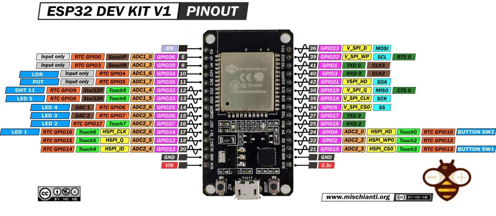

# IoT projects

  

---
These are projects  that uses the ESP32 module involving its IoT  capabilities.

## Techs and ESP32 features used
  - Wi-Fi connectivity
  - Bluetooth connectivity
  - MQTT protocol communication
  - Pairing with google assistant for controlling devices.
  - Telegram Bot communication

## Hardware Requirements

  - ESP32 development board
  - Sensors: 
    - DHT sensor
    - LDR sensor
  

## Software Requirements

- List any software dependencies or libraries required to run your project, including:
  - Arduino IDE
  - ESP-IDF (Espressif ESP32 Card Support)
  - Additional libraries for sensors, communication protocols, etc.

---

  

## Installation
1. Install Arduino IDE 1.8.19
2. In case than the IDE doesn't recognize IDE install the drivers:

https://www.silabs.com/developers/usb-to-uart-bridge-vcp-drivers?tab=downloads

3. Install card support for ESP32 Default adding this url to libraries repositories:
https://dl.espressif.com/dl/package_esp32_index.json

1. Download or clone this repository
2. Install the following libraries (from Espressif) trough the Arduino IDE package manager:

For Telegram Bot Project

  - CTBot

For Bluetooth project:

  - BluetoothSerial

For MQTT and Bluetooth projects:

  - DHT
  - EspMQTTClient

For Google Assistant project

  - WiFiSinricPro
  - SinricProSwitch
  - SinricProDimSwitch
  

## Bluetooth Project

This project can use two ESP32 for:

  **1 On receiving(master):**

  Turns a leds sucesion depending of number received.

  **2 On sending(slave):**

  Sends the temperature/humidity of DHT depending of the button pressed.

## Bot Project
The user can interact with ESP32 through bot telegram with the following actions:

  - Using the LDR sensor receives an alarm actiation depending the threshold
  - Receive the potentiometer voltage
  - Turn on the leds array

  > [!IMPORTANT]  
  > Create your telegram bot with botfather and inserts the token and ssid and password values in source code
  
   

  

## Google Project
Through Sinric Pro:
  - The user can turn on leds with auto turning off by timer.
  - Also can modify dimmer led 
All this user manipulations trought Google Assistant:
  Registrating the device trought Sinric Pro api
  > [!IMPORTANT]
  > Inserts the ssid/password values in source code

## Mqtt Project

  - Sends the temperature/humidity of DHT depending of the button pressed.
  - Allows led turning on throught topic channels message sending
  - Autopublish of LDR sensor
  
  > [!IMPORTANT]
  > Inserts the ssid/password values and the MQTT broker, client and port values in source code

[MQTT]: http://mqtt-explorer.com/
[Sinric]: https://sinric.pro/es-index.html
[TelegramBot]: https://core.telegram.org/bots
[Arduino]: https://www.arduino.cc/reference/en/
