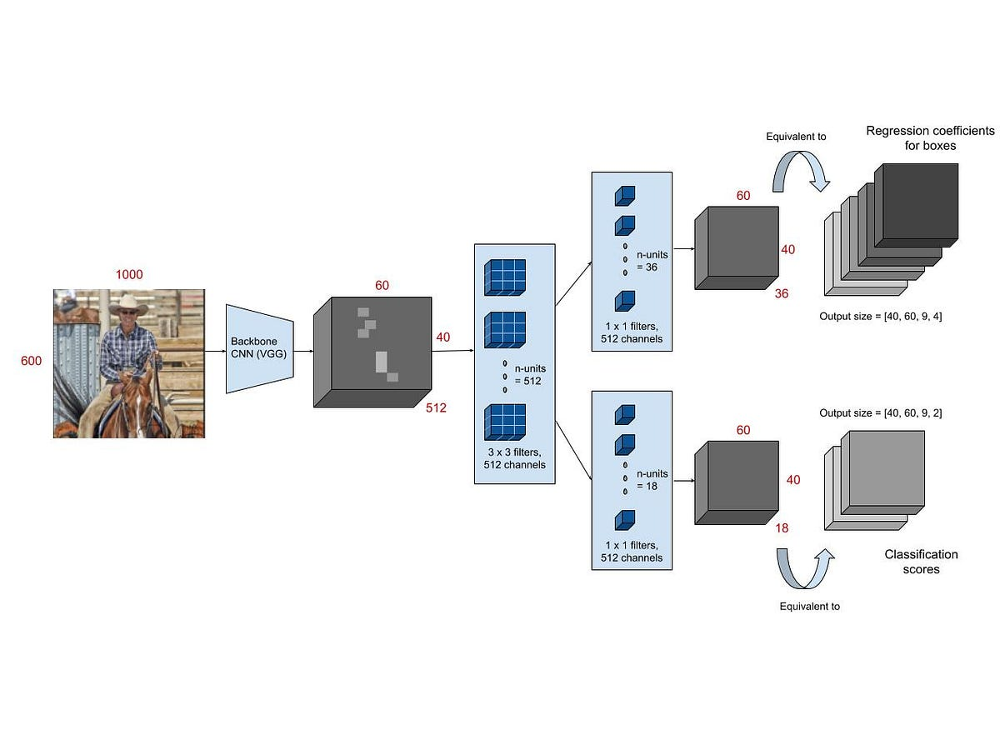
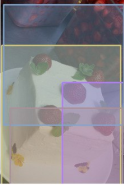

ResNEt 50
COCO Common Objects in Context 2017
Kaggle
annotations box bounded box (JSON)
Fast RCNN
IoU
Results


# Fine-tuning ResNet-50 for Object Detection with COCO
Technologies:


<p>
  
</p>

This project aims to fine-tune the ResNet-50 convolutional neural network for object detection tasks using the COCO (Common Objects in Context) dataset. 

## Overview

Object detection is a computer vision task that involves identifying and locating objects within an image. The COCO dataset is a widely used benchmark for object detection, containing a large collection of images labeled with bounding boxes and class labels for various objects.

## Requirements

- Python 3.x
   - PyTorch
   - Pillow
- COCO dataset

<p align="center">
  
</p>

## Installation

1. Clone or download this repository:

   ```bash
   git clone https://github.com/your-username/resnet50-object-detection.git

- Download the COCO 2017 object detection dataset and preprocess it for training (annotations included due to Kaggle default dataset containing).
Try with train/eval volume reduced:

http://images.cocodataset.org/annotations/annotations_trainval2017.zip

Or with full dataset:

http://images.cocodataset.org/zips/train2017.zip
## Usage
1. Fine-tune ResNet-50:
Using the training section provided on [notebook]s to fine-tune the ResNet-50 model on the COCO dataset.
Experiment with different hyperparameters, such as learning rate, batch size, and optimization algorithms.

1. Evaluate the model:

Use the evaluation [notebook] section to try with the example image or any other from  
## Metrics
The model uses what is called Intersection over union index (IoU), this metric measures the shared area between the predicted bounded box of the object detected and the rear one compared with the total area of both.


Include any results or performance metrics obtained from fine-tuning ResNet-50 on the COCO dataset. This section can include tables, graphs, or visualizations showcasing the model's performance.

<p align="center">
  
</p>

The results are alike this one, for a more specific report you can run the [notebook].

<p align="center">
  
</p>

<p align="center">
  
</p>

[notebook]: proyectofinal-ml/object_detection.ipynb