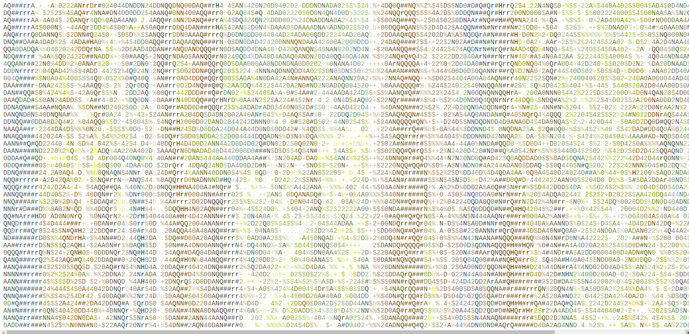

# Image Filtering Project
This project showcases my skills in digital image processing using __[Pillow]__ and algorithm implementation with python GUI trough __[Tkinter]__ library.
<p align="center">
  
</p>
<p align="center">
  
</p>

<p align="center">
  
</p>


**Character made photos**

<p align="center">
  
  
  
</p>

<p align="center">
  
.  
  
</p>

Whether you're a beginner or an expert in image manipulation, this project provides a versatile toolkit for filtering images.

## Techs


__Python__ techs as:
- **[Tkinter]** for GUI 
- **[Pillow]** for images manipulation
- **OOP**


## Features

- **Diverse Filters**: Apply various filters such as 
    - Convolutional
    - Morphological
    - Dithering
    - Character Filters
    - And more
- **Customization**: Fine-tune filter parameters to achieve specific visual effects.
- **Real-time Preview**: See immediate changes as you adjust filters for an interactive experience.
- **Support for Multiple Formats**: Work seamlessly with popular image formats including JPEG, PNG, GIF, and BMP.
- **User-Friendly Interface**: Intuitive interface design for effortless image manipulation.


## Installation

To explore and utilize the capabilities of the Image Filtering Project, follow these installation instructions:

1. Download or clone this repository
2. Install the python libraries required also in __requirements.txt__.:

- [Tkinter]
- [Pillow]

With the following commands:
```sh
pip install tkinter
```

```sh
pip install pillow
```

and run the python script with (in their directory):
```sh
python <filter-project>.py
```
__OR__

If you are using a Linux system

3. Choose a python executable and launch the filter application just double clicking or executing it.

```sh
./<filter-project>
```

## Usage
1. Load an image from your local storage.
2. Select your desired filter from the provided options.
3. Adjust filter parameters to fine-tune the effect, if needed.
4. Preview the filtered image in real-time.
5. Save the filtered image to your preferred location.

[Pillow]: https://pillow.readthedocs.io/en/stable/

[Tkinter]: https://docs.python.org/3/library/tk.html

## Filters

### Color

- Mosaic
- Gray Tones
- Red
- Green
- Blue
- Invert colors
- Hight contrast
- Brigth

## Convolutional

IA convolutional technics.

- Blur
- Motion blur
- Find edges
- Sharpen
- Emboss
- Promedian
- Median
- Color mix
## Character

-Substitute pixels by characters or font symbols.

- Color letters
- Gray tone unique letter
- Letter density gray tone
- Text color letters
- Card
- Dominó

## Mosaic image recursive

Substitute sub mosaic into original image with the most adecuate color into a set of images (without color filter).

- Mosaic 

## Morphological

Anti-aliasing black and white filter.

- Minimum black and white
- Maximum black and white

## Watermark remover

- Paper unicolor watermark remover

## Mosaic recursive

Substitute sub mosaic into original image with itself color and size.

- Color recursive mosaic image
- Graytone recursive mosaic image

## Dithering
Technic for emulating graytone filter with black  & white images.

- Dithering Jarvis
- Dithering Steinberg

## Postit

Substitute a image region with postit image with their mean color.

- Color Postit 
- Gray Postit 

## Sepia

- Sepia filter
- At&t logo effect

